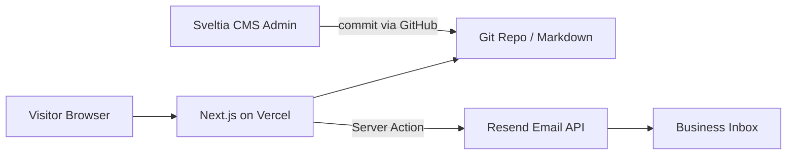
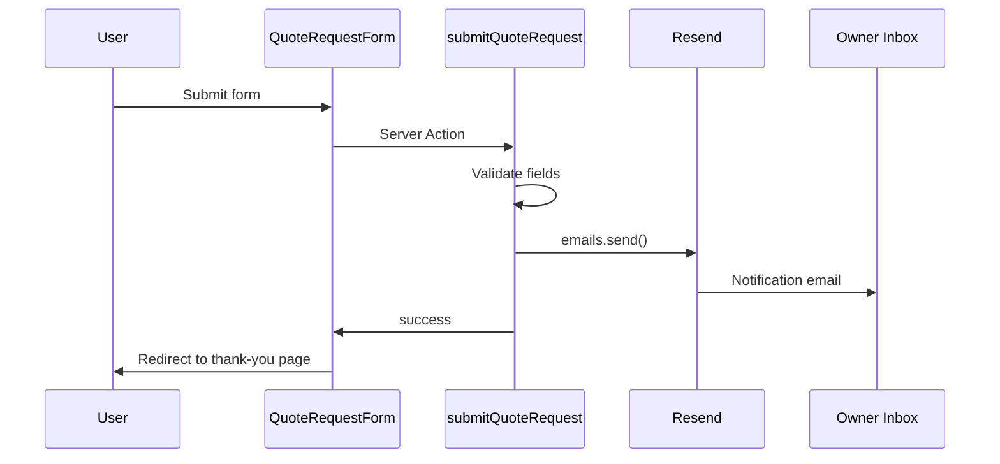
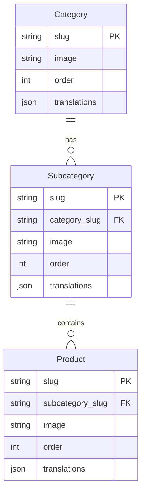

# Technical Architecture & Implementation

## DALI SOUND — Instrument & Speaker Rental Platform

**Version:** 1.0  
**Last updated:** July 2026  
**Related:** [PDR.md](./PDR.md)

---

## 1. Overview

DALI SOUND v1 is a **static-first, CMS-backed marketing site** built with **Next.js 16 (App Router)**. Public pages are server-rendered from **Git-managed Markdown content** edited through **Sveltia CMS**. Lead capture uses a **Server Action** and **Resend** for transactional email. There is **no application database** in v1.



---

## 2. Technology stack

| Layer | Choice | Role |
|---|---|---|
| **Framework** | Next.js 16.2 (App Router) | Routing, SSR/SSG, Server Actions, i18n routes |
| **UI** | React 19 | Components and client interactivity |
| **Language** | TypeScript 5 | Type safety across app and content loaders |
| **Styling** | Tailwind CSS 4 | Utility-first responsive layout |
| **Components** | shadcn/ui (`base-vega` preset) | Buttons, forms, accordion, select, etc. |
| **Icons** | Hugeicons | Consistent icon set per `components.json` |
| **CMS** | Sveltia CMS | Git-based admin at `/admin` |
| **Content storage** | Markdown + YAML frontmatter in repo | Categories, subcategories, products |
| **Media** | `public/uploads/` | Images uploaded via CMS |
| **Email** | Resend | Quote/inquiry notifications |
| **Hosting** | Vercel | Build, deploy, env vars, preview URLs |
| **Version control** | GitHub | Source of truth for code and CMS content |

### Explicitly not used in v1

- Supabase / Postgres (packages present in repo but unused for v1 scope)
- n8n / Zapier webhooks
- Customer auth (NextAuth, Clerk, etc.)
- Payment providers (Stripe, etc.)
- External headless CMS APIs (Sanity, Contentful) — content lives in Git

---

## 3. High-level architecture

### 3.1 Rendering model

| Page type | Strategy |
|---|---|
| Marketing pages (home, legal) | Server Components; static section copy from i18n JSON/message files |
| Catalog pages | Server Components; read Markdown at build/request time from `content/` |
| Language gate | Client Component for selection; sets cookie; redirects to `/[locale]/` |
| Inquiry form | Client Component UI + Server Action submission |
| Thank-you page | Static Server Component per locale |

Next.js **App Router** file conventions:

```
app/
  [locale]/
    layout.tsx          # Locale shell, header, footer
    page.tsx              # Homepage
    equipment/
      [category]/
        page.tsx          # Category → subcategories
        [subcategory]/
          page.tsx        # Product listing
          [product]/
            page.tsx      # Product detail
    thank-you/
      page.tsx
    privacy/page.tsx
    terms/page.tsx
    impressum/page.tsx
  actions/
    quote-request.ts      # Server Action (existing)
middleware.ts             # Locale detection, gate redirect
```

### 3.2 Content pipeline (Sveltia CMS)

Sveltia CMS is configured at `public/admin/config.yml` with a **GitHub backend**. When the admin saves content:

1. Sveltia commits Markdown files to the repository (`content/`).
2. Vercel rebuilds on push to `main` (or preview on branch).
3. Next.js content loaders parse frontmatter and expose typed data to pages.

**Planned content folders (v1):**

```
content/
  categories/       # One .md file per category
  subcategories/    # One .md file per subcategory
  products/         # One .md file per product
public/
  uploads/          # CMS-uploaded images
  admin/            # Sveltia admin shell (index.html, config.yml)
```

**Example product frontmatter (illustrative):**

```yaml
---
slug: yamaha-cp88
category: keyboards
subcategory: solo-keyboards
image: /uploads/yamaha-cp88.jpg
order: 1
translations:
  en:
    name: Yamaha CP88
    description: Stage piano for live performance.
    specs: |
      - 88 weighted keys
      - Built-in speakers
  de:
    name: Yamaha CP88
    description: Stage-Piano für Live-Auftritte.
    specs: |
      - 88 gewichtete Tasten
      - Eingebaute Lautsprecher
  # ... remaining locales
---
```

Exact schema will be finalized in `config.yml` when collections are reshaped from the current placeholder `items` collection.

### 3.3 Internationalization (i18n)

**Requirements from PDR:** 12 locales, URL prefix, language gate, header switcher.

**Implementation approach:**

| Concern | Implementation |
|---|---|
| **Routing** | Dynamic segment `app/[locale]/...` with locale validation |
| **UI strings** | `messages/[locale].json` or equivalent (next-intl or custom loader) |
| **CMS strings** | Per-locale fields in Markdown frontmatter (`translations` object) |
| **Default locale** | `en` |
| **Middleware** | Redirect `/` → language gate or last-known locale from cookie |
| **Language gate** | Route `/select-language` or modal on first visit; sets `locale` cookie |
| **Switcher** | Links to same path under different locale prefix |

**Supported locale codes:**

`en`, `de`, `fr`, `it`, `es`, `nl`, `sr`, `mk`, `bg`, `el`, `ro`, `pl`

**Fallback behavior:** If a CMS field is missing for a locale, fall back to `en` and log a build-time warning.

---

## 4. Feature implementation map

### 4.1 Homepage sections

| Section | Source | Component type |
|---|---|---|
| Hero | i18n messages + static assets | Server + client CTAs (scroll) |
| Equipment categories | `content/categories/` | Server; links to `/[locale]/equipment/[slug]` |
| How it works | i18n messages | Server |
| Why choose us | i18n messages | Server |
| Past events gallery | Static images in `public/gallery/` | Server |
| FAQ | i18n messages (array of Q&A) | Client accordion (shadcn) |
| Contact | `QuoteRequestForm` + static contact | Client form + Server Action |

### 4.2 Catalog navigation

Content loaders in `lib/content/`:

```typescript
// Illustrative API surface
getCategories(locale): Category[]
getCategory(slug, locale): Category | null
getSubcategories(categorySlug, locale): Subcategory[]
getSubcategory(categorySlug, subcategorySlug, locale): Subcategory | null
getProducts(subcategorySlug, locale): Product[]
getProduct(subcategorySlug, productSlug, locale): Product | null
```

**Validation rules (enforced in loaders):**

- Only return categories from the fixed allowlist of 6 slugs.
- Hide categories with zero subcategories.
- Hide subcategories with zero products (optional UX: show empty state).
- Resolve localized fields from `translations[locale]`.

**No search index** in v1 — simple filesystem read and filter at build time. For large catalogs later, consider `generateStaticParams` + incremental static regeneration.

### 4.3 Inquiry form & email

**Existing implementation (to extend):**

- `components/quote-request-form.tsx` — form UI
- `app/actions/quote-request.ts` — Server Action + validation
- `lib/email/*` — Resend client, templates, config

**v1 changes required:**

| Change | Detail |
|---|---|
| Add **country** field | Required select: CH, DE, FR |
| Make **phone** required | Align with PDR |
| Make **event date** required | Align with PDR |
| Thank-you redirect | `redirect('/[locale]/thank-you')` on success instead of inline message only |
| Email template | Include country in notification body |

**Email flow:**



**Environment variables:**

| Variable | Purpose |
|---|---|
| `RESEND_API_KEY` | Resend API authentication |
| `RESEND_FROM_EMAIL` | Verified sender address |
| `RESEND_FROM_NAME` | Display name (e.g. DALI SOUND) |
| `RESEND_NOTIFICATION_EMAIL` | Inbox receiving form submissions |

### 4.4 Language gate

- **Cookie:** `NEXT_LOCALE` (or similar), `httpOnly: false`, `maxAge: 1 year`, `sameSite: lax`.
- **Middleware logic:**
  - If path is `/` and no cookie → redirect to `/select-language`
  - If path is `/` and cookie exists → redirect to `/[cookie-locale]/`
  - If path missing locale prefix → redirect to prefixed path
- **Gate page:** Grid of 12 language buttons → set cookie → navigate to `/[locale]/`

---

## 5. CMS configuration (Sveltia)

### 5.1 Current state

- Admin entry: `/admin/index.html`
- Config: `public/admin/config.yml`
- Backend: GitHub (`luigicastello78-ux/dali-sound-0.2v`, branch `main`)
- Placeholder collection: `items` → `content/items/`

### 5.2 Target state (v1)

Replace placeholder with three collections matching PDR:

1. **categories** → `content/categories/`
2. **subcategories** → `content/subcategories/` (relation field → category)
3. **products** → `content/products/` (relation field → subcategory)

Each collection uses:

- `slug` field for URL segments
- `image` widget → `public/uploads/`
- Nested `translations` list or locale-keyed fields for 12 languages (schema TBD based on Sveltia widget support)

### 5.3 Production CMS auth

GitHub backend requires OAuth for non-local editing:

1. Deploy Cloudflare Worker (or compatible auth proxy) for GitHub OAuth.
2. Set `base_url` and `auth_methods: [oauth]` in `config.yml`.
3. Restrict admin access to site owner GitHub account.

Local development can use Sveltia’s local backend or test commits on a branch.

---

## 6. UI & design system

### 6.1 shadcn/ui

- Preset: `base-vega` from `components.json`
- Add components via CLI as needed: `button`, `input`, `textarea`, `select`, `accordion`, `label`, `card`
- Always check MCP / registry before creating custom primitives

### 6.2 Theme tokens

Define in `app/globals.css` (CSS variables):

| Token | Value (reference) |
|---|---|
| Background | Dark charcoal (`~#0E0E0E`) |
| Foreground | White / light gray text |
| Accent / primary | Orange (match previous site screenshot) |
| Card background | Slightly elevated dark surface |
| Border | Subtle dark border |

Typography: clean sans-serif (Geist or project font from layout).

### 6.3 Layout components

```
components/
  layout/
    site-header.tsx       # Sticky nav, locale switcher, CTA
    site-footer.tsx       # Links, legal, social
    language-gate.tsx     # First-visit selector
  sections/
    hero-section.tsx
    categories-section.tsx
    how-it-works-section.tsx
    why-us-section.tsx
    gallery-section.tsx
    faq-section.tsx
    contact-section.tsx
  equipment/
    category-card.tsx
    product-card.tsx
  quote-request-form.tsx
  ui/                     # shadcn primitives
```

### 6.4 Responsive breakpoints

Follow Tailwind defaults: mobile-first, `md` for tablet, `lg` for desktop grids (category cards, gallery 2×3).

---

## 7. Routing reference

| Route | Description |
|---|---|
| `/select-language` | First-visit language gate |
| `/[locale]/` | Homepage |
| `/[locale]/equipment/[category]` | Subcategory grid |
| `/[locale]/equipment/[category]/[subcategory]` | Product listing |
| `/[locale]/equipment/[category]/[subcategory]/[product]` | Product detail |
| `/[locale]/thank-you` | Post-form confirmation |
| `/[locale]/privacy` | Privacy policy (placeholder) |
| `/[locale]/terms` | Terms (placeholder) |
| `/[locale]/impressum` | Impressum (placeholder) |
| `/admin/*` | Sveltia CMS (static admin app) |

**Anchor IDs for smooth scroll:** `#contact`, `#faq`, `#gallery`, `#how-it-works`, `#why-us`, `#equipment`

---

## 8. Data model (logical)



**Fixed category slugs (seed data):**

`keyboards`, `drums`, `guitars`, `speakers`, `mixers`, `microphones`

---

## 9. Security & privacy

| Topic | Approach |
|---|---|
| **Secrets** | Env vars on Vercel; never commit `.env` |
| **Form abuse** | Server-side validation; optional honeypot in v1.1 |
| **CMS write access** | GitHub OAuth; repo permissions limited to admin |
| **PII in email** | Form data sent to owner inbox only; not logged to third parties |
| **Legal** | Impressum + Privacy placeholders until final copy |
| **HTTPS** | Enforced by Vercel |

---

## 10. Deployment & environments

### 10.1 Vercel

- Connect GitHub repository.
- Production branch: `main`.
- Preview deployments on pull requests.
- Environment variables set per environment (Production / Preview).

### 10.2 Build

```bash
npm run build   # next build
npm run start   # next start (production)
npm run dev     # local development
```

Content changes via Sveltia trigger a Git push → Vercel rebuild. No separate CMS webhook required.

### 10.3 Image handling

- CMS uploads → `public/uploads/`
- Next.js `<Image>` for optimized delivery
- Configure `images.remotePatterns` in `next.config.ts` if remote URLs are used later

---

## 11. Implementation phases

### Phase 1 — Foundation

- [ ] Locale routing (`[locale]`, middleware, cookie)
- [ ] Language gate page
- [ ] i18n message files for 12 languages (structure; copy from client)
- [ ] Layout: header, footer, theme tokens (dark + orange)
- [ ] Placeholder legal pages

### Phase 2 — Homepage

- [ ] All homepage sections per PDR
- [ ] Static gallery (6 tiles)
- [ ] FAQ accordion
- [ ] Smooth-scroll CTAs

### Phase 3 — CMS & catalog

- [ ] Reshape Sveltia `config.yml` (categories, subcategories, products)
- [ ] Content loaders in `lib/content/`
- [ ] Category → subcategory → product → detail pages
- [ ] Seed 6 categories and sample subcategories/products

### Phase 4 — Lead capture

- [ ] Update form fields (country, required phone/date)
- [ ] Update email template
- [ ] Thank-you page + redirect flow

### Phase 5 — Polish & launch

- [ ] Client content in all 12 languages
- [ ] CMS OAuth for production admin
- [ ] Resend domain verification
- [ ] Responsive QA, accessibility pass
- [ ] Replace legal placeholders when copy arrives

---

## 12. Testing strategy (v1)

| Area | Method |
|---|---|
| i18n routes | Manual: each locale loads; switcher preserves path |
| Catalog | Manual: navigation across all levels; empty states |
| Form | Manual: validation errors, success email, thank-you redirect |
| CMS | Admin: create/edit/delete item; verify Git commit and site rebuild |
| Responsive | Chrome DevTools + real devices for header, grids, form |
| Email | Resend dashboard + test inbox |

Automated tests are optional for v1; add Playwright/Vitest in a later phase if needed.

---

## 13. Dependencies (current `package.json`)

**Runtime:**

- `next@16.2.10`, `react@19.2.4`, `react-dom@19.2.4`
- `resend@^6.17.2`
- `@base-ui/react`, `class-variance-authority`, `clsx`, `tailwind-merge`
- `@hugeicons/react`, `@hugeicons/core-free-icons`

**Dev:**

- `tailwindcss@^4`, `typescript@^5`, `eslint`, `eslint-config-next`

**To add (recommended during Phase 1):**

- `next-intl` or similar for i18n (evaluate vs lightweight custom solution)
- Additional shadcn components as needed

---

## 14. File structure (target)

```
dali_sound_rent/
├── app/
│   ├── [locale]/
│   │   ├── layout.tsx
│   │   ├── page.tsx
│   │   ├── equipment/...
│   │   ├── thank-you/page.tsx
│   │   ├── privacy/page.tsx
│   │   ├── terms/page.tsx
│   │   └── impressum/page.tsx
│   ├── select-language/page.tsx
│   ├── actions/quote-request.ts
│   ├── globals.css
│   └── layout.tsx
├── components/
│   ├── layout/
│   ├── sections/
│   ├── equipment/
│   ├── quote-request-form.tsx
│   └── ui/
├── content/
│   ├── categories/
│   ├── subcategories/
│   └── products/
├── docs/
│   ├── PDR.md
│   └── Tech.md
├── lib/
│   ├── content/          # Parsers and getters
│   ├── email/
│   ├── i18n/
│   └── utils.ts
├── messages/             # UI translations per locale
├── public/
│   ├── admin/
│   ├── gallery/
│   └── uploads/
├── middleware.ts
├── next.config.ts
└── package.json
```

---

## 15. Risks & mitigations

| Risk | Mitigation |
|---|---|
| 12-language CMS fields are heavy for editors | Structured `translations` in frontmatter; document CMS workflow; fallback to `en` |
| Sveltia OAuth not configured | Local/dev editing on branch; prioritize OAuth before handoff |
| Client content not ready for all locales | Block launch until PDR content checklist complete |
| Resend sandbox limits | Verify domain early; use production API key on Vercel |
| Large catalog slows build | `generateStaticParams`, pagination, or ISR in v2 |

---

## 16. References

- [PDR.md](./PDR.md) — product requirements
- [Sveltia CMS](https://sveltia.com/cms/) — CMS documentation
- [Next.js App Router](https://nextjs.org/docs/app) — routing and Server Actions
- [Resend](https://resend.com/docs) — email API
- [shadcn/ui](https://ui.shadcn.com/) — component library
- Existing code: `public/admin/config.yml`, `app/actions/quote-request.ts`, `lib/email/`
